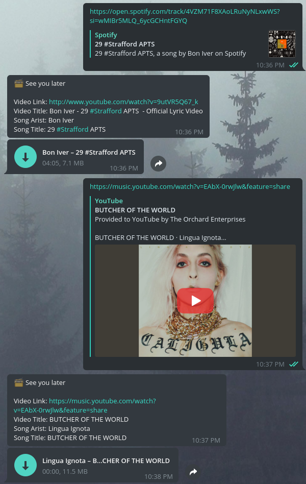

# Spotgram

Telegram bot to convert music links to telegram audio files:

* Links are converted using [`youtube-dl`](https://github.com/ytdl-org/youtube-dl/), so all links supported by ytdl are supported here.
* The bot handles Spotify links. It uses [`spotdl`](https://github.com/ritiek/spotify-downloader) to retrieve the equivalent youtube video, which is then handled by youtube-dl as per usual.
* Instagram links are handled as video files rather than music.

## Usage

Quick start: check out the Dockerfile and systemd template in this repo.
